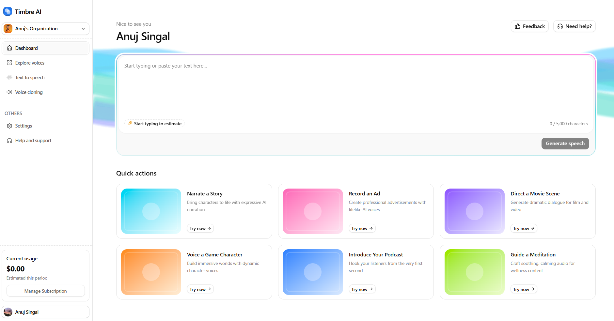

# 🎵 **Timbre AI – AI-Powered Text-to-Speech and Voice Cloning SaaS**

[](https://timbre-ai.vercel.app/)  [](https://github.com/anuj-singal/Timber_AI)

---

A modern **AI-powered Text-to-Speech SaaS** built with **Next.js**, **TypeScript**, **TailwindCSS**, and **Prisma/Postgres**.  
Timbre AI allows users to **generate realistic speech, clone voices instantly, and manage audio workflows** with team-based access and usage-based billing.

---

## 🗣️ Live Demo

**Try it here:**  
👉 [https://timbre-ai.vercel.app/](https://timbre-ai.vercel.app/)


<p align="center">
  
</p>

---

## 🚀 Features

- 📝 **Text-to-Speech** – Generate speech with adjustable creativity, variety, expression, and flow parameters  
- 🗣️ **Zero-Shot Voice Cloning** – Clone any voice from a 10s+ sample instantly, no fine-tuning required  
- 🎤 **20 Built-in Voices** – Pre-seeded system voices across 12 categories and 5 locales  
- 📊 **Waveform Audio Player** – Play, pause, seek, and download with WaveSurfer.js visualization  
- 👥 **Multi-Tenant** – Team access via Clerk Organizations with full data isolation  
- 💸 **Usage-Based Billing** – Metered pricing with Polar for characters and voice generations  
- 🕒 **Generation History** – Browse and replay past audio generations with voice metadata  
- 📱 **Fully Responsive** – Mobile-first, adaptive layouts, and compact controls

---

## 🏗️ Tech Stack


---

## Getting Started

### Prerequisites

- Node.js **20.9** or later
- [Prisma Postgres](https://cwa.run/prisma) database
- [Clerk](https://cwa.run/clerk) account (with Organizations enabled)
- [Cloudflare R2](https://cwa.run/cloudflare-r2) bucket
- [Modal](https://cwa.run/modal) account (for GPU-hosted TTS)
- [Polar](https://cwa.run/polar) account (for billing)

### 1. Clone and install

```bash
git clone https://github.com/code-with-antonio/resonance.git
cd resonance
npm install
```

### 2. Configure environment

```bash
cp .env.example .env
```

Fill in the blank values in `.env`. Sensible defaults (Clerk routes, Polar meter names, `APP_URL`, etc.) are pre-filled.

### 3. Set up Polar billing

In your [Polar](https://cwa.run/polar) dashboard, create two **meters** under **Meters**:

1. **Voice Creation** meter
   - Filter: Name equals `voice_creation`
   - Aggregation: **Count**

2. **Text-to-Speech Characters** meter
   - Filter: Name equals `tts_generation`
   - Aggregation: **Sum** over `characters`

Then create a new **product** with **Recurring subscription** pricing. Under **Price Type**, add two metered prices:

1. Click **Add metered price** and select the **Text-to-Speech Characters** meter
   - Set the **Amount per unit** (price per character, e.g. `$0.003`)
   - Optionally set a **Cap amount** (e.g. `$100`)

2. Click **Add metered price** again and select the **Voice Creation** meter
   - Set the **Amount per unit** (price per voice generation, e.g. `$0.25`)
   - Optionally set a **Cap amount** (e.g. `$100`)

With only metered prices, the subscription starts at **$0/month** and scales with usage. If you want a baseline subscription fee (e.g. $20/month), add a third price to the same product — select a **fixed price** instead of a metered price. This requires no code changes since fixed prices are handled entirely by Polar.

Ensure **Allow multiple subscriptions** is turned **off** under **Settings > Billing** (this is the Polar default).

Copy the product ID into `POLAR_PRODUCT_ID`. The meter filter names and aggregation property must match the `POLAR_METER_*` env variables.

### 4. Set up the database

```bash
npx prisma migrate deploy
```

### 5. Deploy the TTS engine

The included `chatterbox_tts.py` is adapted from [Modal's official Chatterbox TTS example](https://cwa.run/modal-tts), modified to read voice reference audio directly from your R2 bucket instead of a Modal Volume.

Before deploying, update `chatterbox_tts.py` with your R2 credentials:

```python
R2_BUCKET_NAME = "<your-r2-bucket-name-here>"
R2_ACCOUNT_ID = "<your-r2-account-id-here>"
```

Then create the required secrets in your [Modal dashboard](https://cwa.run/modal-secrets):

| Secret Name | Keys | Description |
|-------------|------|-------------|
| `cloudflare-r2` | `AWS_ACCESS_KEY_ID`, `AWS_SECRET_ACCESS_KEY` | R2 API credentials (used for bucket mount) |
| `chatterbox-api-key` | `CHATTERBOX_API_KEY` | API key to protect the endpoint (use any strong random string) |
| `hf-token` | `HF_TOKEN` | Hugging Face token (for downloading the Chatterbox model weights) |

Deploy to Modal:

```bash
modal deploy chatterbox_tts.py
```

This deploys Chatterbox TTS to a serverless NVIDIA A10G GPU on Modal. The container mounts your R2 bucket read-only for direct access to voice reference audio. Use the resulting Modal URL as `CHATTERBOX_API_URL` in your `.env.local`.

> **Note:** The first request after a period of inactivity may take longer due to cold starts as Modal provisions the GPU container.

Once deployed, generate the type-safe Chatterbox client from the OpenAPI spec:

```bash
npm run sync-api
```

### 6. Seed voices

```bash
npx prisma db seed
```

Seeds 20 built-in voices to the database and R2. The system voice WAV files are included in the repository and originate from [Modal's voice sample pack](https://modal-cdn.com/blog/audio/chatterbox-tts-voices.zip).

### 7. Run

```bash
npm run dev
```

Open [http://localhost:3000](http://localhost:3000).

## Self-Hosting

Resonance is designed to be self-hosted. You'll need:

1. **A PostgreSQL database**  - [Prisma Postgres](https://cwa.run/prisma) (recommended), or any managed Postgres
2. **Cloudflare R2**  - For audio storage (S3-compatible, generous free tier)
3. **Modal**  - For serverless GPU inference (pay-per-second billing)
4. **Clerk**  - For authentication and multi-tenancy
5. **Polar**  - For metered billing (use sandbox mode with card `4242 4242 4242 4242` for testing)

Deploy the Next.js app to any Node.js host (Railway, Docker, etc.).

## Project Structure

```
src/
├── app/                        # Next.js App Router
│   ├── (dashboard)/            # Protected routes (home, TTS, voices)
│   ├── api/                    # Audio proxy routes + tRPC handler
│   ├── sign-in/                # Clerk auth pages
│   └── sign-up/
├── components/                 # Shared UI components (shadcn/ui + custom)
├── features/
│   ├── dashboard/              # Home page, quick actions
│   ├── text-to-speech/         # TTS form, audio player, settings, history
│   ├── voices/                 # Voice library, creation, recording
│   └── billing/                # Usage display, checkout
├── hooks/                      # App-wide hooks
├── lib/                        # Core: db, r2, polar, env, chatterbox client
├── trpc/                       # tRPC routers, client, server helpers
├── generated/                  # Prisma client
└── types/                      # Generated API types
```

## Scripts

| Command | Description |
|---------|-------------|
| `npm run dev` | Start dev server |
| `npm run build` | Production build |
| `npm run start` | Start production server |
| `npm run lint` | Lint with ESLint |
| `npm run sync-api` | Regenerate Chatterbox API types from OpenAPI spec |

## Acknowledgements

- [Chatterbox TTS](https://github.com/resemble-ai/chatterbox) by Resemble AI - the open-source zero-shot voice cloning model powering speech generation
- [Modal](https://cwa.run/modal-tts) - serverless GPU deployment example and [voice sample pack](https://modal-cdn.com/blog/audio/chatterbox-tts-voices.zip)

---

## 📜 License

MIT License  
Copyright (c) 2025 Anuj Singal

---

## 👨‍💻 Author

[](https://github.com/anuj-singal)  
[](https://www.linkedin.com/in/anujsingal/)

<p align="center">⭐ If you like Timbre AI, consider giving it a star!</p>
